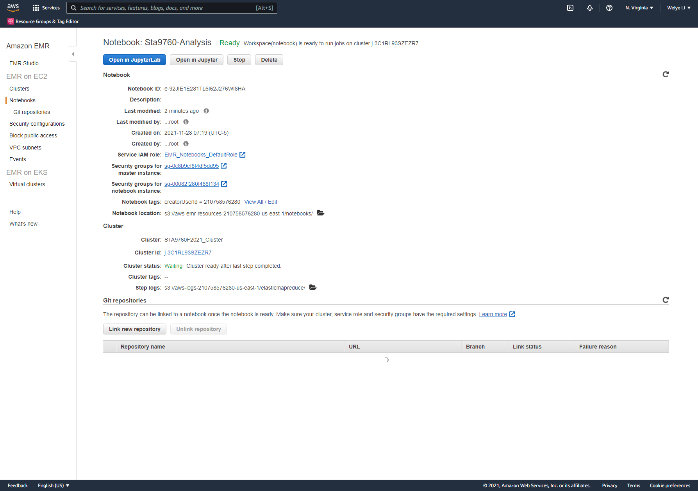
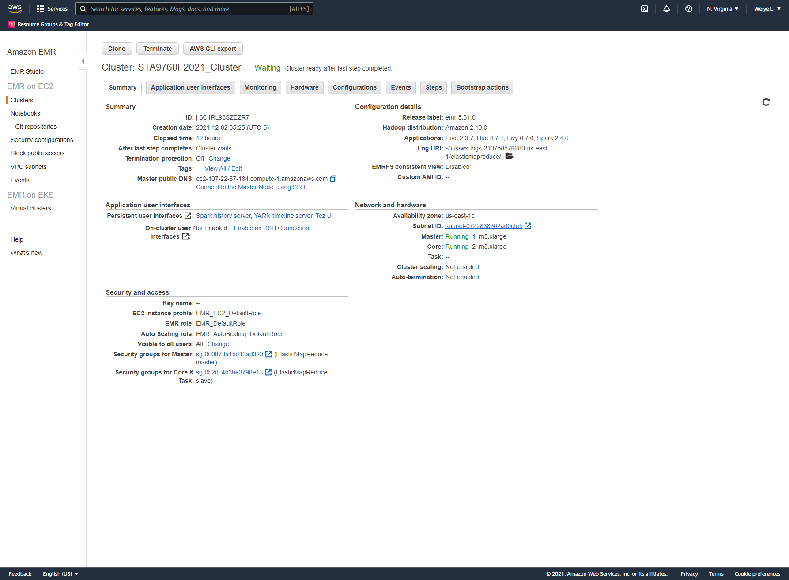

# Analyzing 10Gb of Yelp Reviews Data

We will analyze a subset of Yelp's business, reviews and user data. This dataset comes to us from [Kaggle](https://www.kaggle.com/yelp-dataset/yelp-dataset) although we have taken steps to pull this data into a publis s3 bucket: `s3://sta9760-yelpdataset/yelp-light/*business.json`

## [Analysis](https://github.com/Weiye116/yelp_project/blob/main/Analysis.ipynb)
After initial setup and importing, I loaded business dataset first. Creating tables with different columns to see the content of the data.
The next step is creating categories table and convert it to Panda dataframe for in order to plot barchart as showed in Analysis.

I loaded review dataset and calculated average stars. Combined two dataframe into one to calculate skewness of the data.
The formular is showing below: merged['skew'] = ((merged.avg_stars - merged.stars) / merged.stars) 
Then plot histograms based on the skewness

The last part I loaded user dataset and get elite and non elite users data. plot a scatter to see the difference.
And then compared elite rating with all rating using boxplot. They all look simillar.
So I decided to join review dataset with user dataset to see the change of overall stars and average stars for different users
And then compare it with elit users to see how accurate or close are the ratings of an "elite" user (check Users table schema) vs the actual business rating

Note that the output of the code written is provided as a means to give you structure as you write your analysis. For **Parts I, II & III**, you must fill in the blanks (however way you want) to get the output provided in the file. (Mainly columns and aggregations, I don't care about the exact rows). For **Parts III and IV**, you are more flexibility to take the analysis further however you see fit.

## Cluster and Notebook Configs

